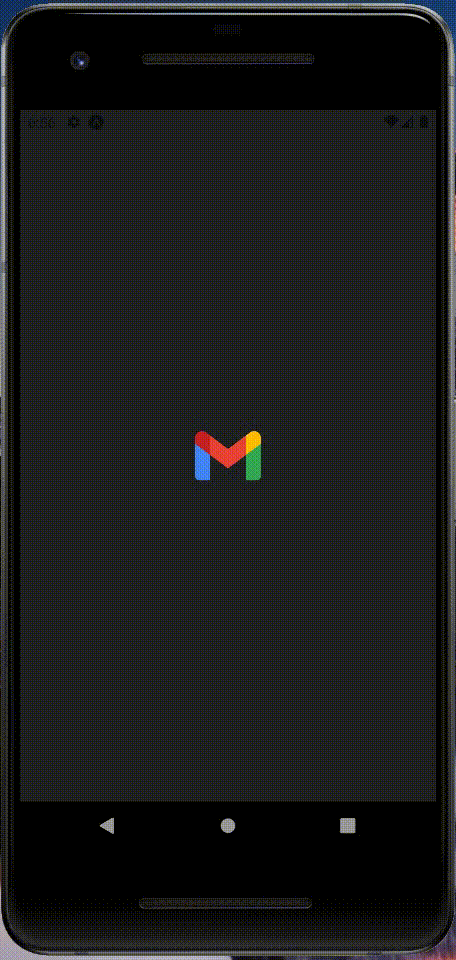
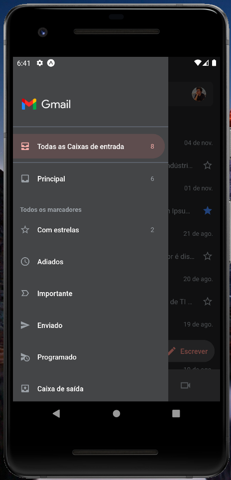

# Gmail UI (UI Clone) - React Native
[](#) 
[](#)

<!-- ## 📸 Preview 

<div align="center">
  <div style="display: flex; justify-content: center;">
    
  </div>
</div> -->

## 📝 Descrição

Projeto simples para recriação da tela principal do Gmail e navegação usando React Native (Expo).

## 🚀 Objetivo

Projeto para prática e aprendizado das libs do Expo mais recentes (2023 e 2024),utilização do Tailwind CSS no React Native usando a lib NativeWind e navegação de diferentes tipos aninhadas (Tab e Drawer).

## 📚 Principais Libs Utilizadas

- [Expo Router](https://docs.expo.dev/router/introduction/)
- [NativeWind v4](https://www.nativewind.dev/v4/overview)
- [clsx](https://www.npmjs.com/package/clsx)

## 🔎 Instruções para rodar o projeto
📌 **Pré requisitos:**
1. Tenha o repositório clonado em sua máquina.
2. Tenha o [NodeJS](https://nodejs.org/) instalado em sua máquina.
3. É importante configurar o seu próprio `.env` e `.env.local` baseando-se no `.env.exemple` presente no projeto (Caso tenha).


🚩 **Como Executar:**
1. Com o terminal aberto no diretório do projeto, execute o comando `npm i --force` para instalar as dependências.
2. Após a instalação, você deve rodar o projeto localmente usando o comando `npm start` e escolher as opções para execução a depender do ambiente. (Esse projeto também é compatível com o Expo Go.)
3. Caso queira executar o expo e limpar o cache, use `expo start -c` para executar e limpar o cache.

## 🗑️ Limpar Chache do EXPO - Windows
Em algumas situações, vai ser necessário limpar o cache do EXPO, para isso, execute os seguintes passos ou confira a [documentação oficial](https://docs.expo.dev/troubleshooting/clear-cache-windows/):

```bash
rm -rf node_modules // Ou apague a pasta manualmente

npm cache clean --force

npm install

watchman watch-del-all

del %localappdata%Temphaste-map-*

del %localappdata%Tempmetro-cache

npx expo start --clear
```

## 📸 Preview das Telas

<div align="center">
  <div style="display: flex; justify-content: center; flex-wrap: wrap; gap: 8px;">
    
    
  </div>
</div>
